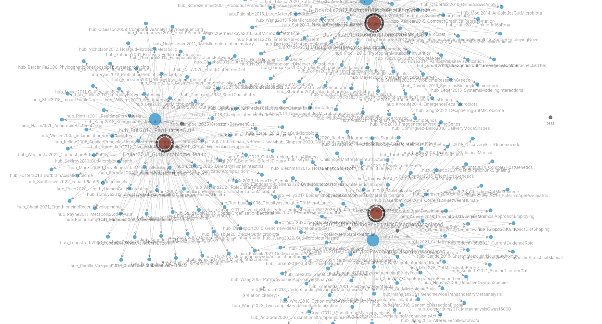
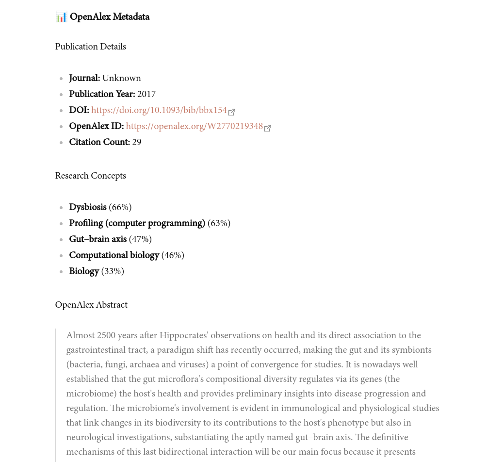
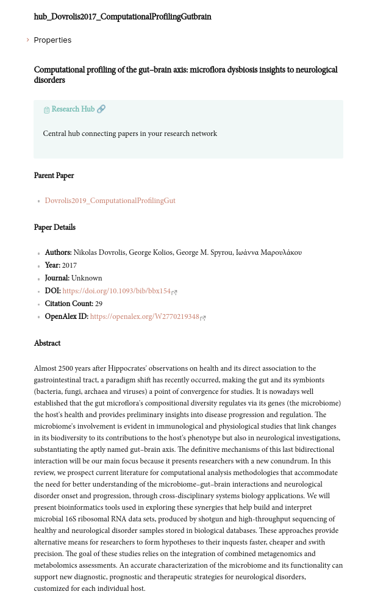
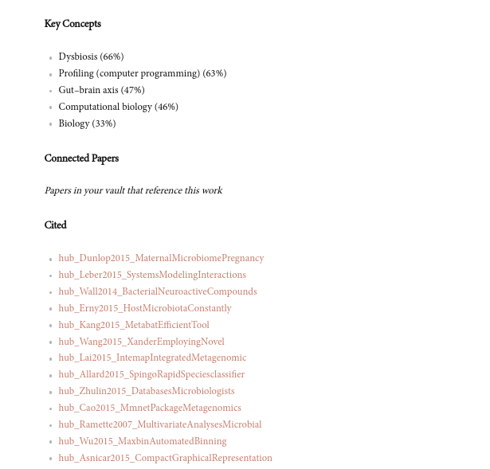
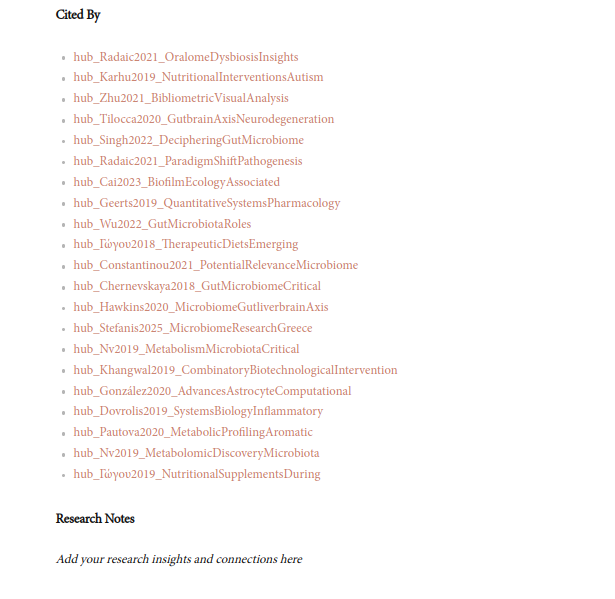

# OpenAlex Research Assistant - User Guide

Transform your Obsidian vault into a powerful research network with automated paper processing and citation mapping.

## 🌟 What Does This Plugin Do?

The OpenAlex Research Assistant automatically enriches your academic papers with:
- **Citation Networks**: See what papers cite your work and what your papers references are
- **Research Hubs**: Central small connection points that link related papers together
- **Metadata Enhancement**: Automatically add journal info, publication years, and research concepts
- **Visual Network**: Create a beautiful graph view of your research connections

### Hub Based Connected Papers Example - (Using Primary Citations and References)

## 🚀 Quick Start Guide

### Step 1: Install the Plugin

1. Open Obsidian Settings (Ctrl/Cmd + ,)
2. ~~Go to **Community Plugins** → **Browse**~~ For now use the release or this repo 
 and put it into ``YOUR_VAULT/.obsidian/plugin/`` folder at first
3. Search for "OpenAlex Research Assistant"
4. Click ~~**Install** and~~ **Enable**

### Step 2: Configure Your Folders

1. Open **Settings** → **OpenAlex Research Assistant**
2. Set your **Zotero folder** (where your papers are imported)
   - Default: `Papers`
   - Example: `Research/Papers` or `Zotero-Import`
3. Set your **Research hubs folder** (where connection hubs will be created)
   - Default: `Research-Hubs`
   - Example: `Networks` or `Citation-Hubs`

### Step 3: Import Your First Paper

1. Import a paper from Zotero or create a new note in your Papers folder
2. Make sure your paper has either:
   - A **DOI** (Digital Object Identifier)
   - A clear **title** in the frontmatter or as a heading

### Step 4: Process Your Paper

**Option A: Manual Processing**
1. Open the zotero note paper you want to process
2. Press **Ctrl/Cmd + P** to open the command palette
3. Type "Process current file with OpenAlex"
4. Press Enter

**Option B: Auto-Processing**
1. In settings, enable **Auto-process new files**
2. Any new papers in your Zotero folder will be automatically processed

### Step 5: Explore Your Research Network

After processing, you'll see:
- **Enhanced paper notes** with metadata, concepts, and abstracts
- **Research hub files** in your Research-Hubs folder
- **Citation connections** linking related papers

## 🎯 Key Features Explained

### Research Hubs

Research hubs are the heart of your citation network. Each hub represents a paper and shows:

- **Parent Paper**: The paper in your vault that this hub represents
- **Connected Papers**: Other papers in your vault that reference this work
- **Cited**: Papers that this work references
- **Cited By**: Papers that cite this work

### Enhanced Paper Metadata

Your Zotero paper notes get automatically enhanced with:
- Publication details (journal, year, DOI)
- Research concepts and their relevance scores
- Citation counts
- OpenAlex abstract (if available)
- Direct links to related papers

### Graph View Visualization

Use Obsidian's Graph View to see your research network:
- **Blue nodes**: Your papers
- **Orange nodes**: Research hubs
- **Red nodes**: Referenced papers not in your vault (phantom links)
### Hub Example -

## 🔧 Settings Guide

### Basic Settings

| Setting | Description | Recommended Value |
|---------|-------------|-------------------|
| **Auto-process new files** | Automatically process new papers when imported | ✅ Enabled for convenience |
| **Create research hubs** | Generate hub files for citation networks | ✅ Enabled (core feature) |
| **Create phantom links** | Create hubs for papers not in your vault | ✅ Enabled for complete network |
| **Enable notifications** | Show processing status messages | ✅ Enabled for feedback |

### Advanced Settings

| Setting | Description | Recommended Value |
|---------|-------------|-------------------|
| **Max references to process** | How many cited papers to process per paper | 100 (balance between completeness and speed) |
| **Max cited-by papers** | How many citing papers to process | 50 (prevents overwhelming networks) |
| **Request delay** | Delay between API calls to avoid rate limiting | 200ms (respects API limits) |

## 📋 Daily Workflow

### For New Papers
1. Import paper from Zotero
2. Wait for auto-processing (or manually trigger)
3. Check the generated hub in Research-Hubs folder
4. Add your own notes to the hub's "Research Notes" section

### For Existing Research
1. Use Graph View to explore connections
2. Follow hub links to discover related papers
3. Add papers from "Cited" or "Cited By" sections to your reading list
4. Connect your thoughts in the hub's research notes

## 🔍 Finding Connections

### Discover New Papers
- Check the **"Cited By"** section in hubs to find recent work
- Look at **"Cited"** sections to trace foundational papers
- Use **phantom links** to identify important papers to acquire

### Track Research Evolution
- Follow citation chains through multiple hubs
- See how your field has developed over time
- Identify influential papers and authors

## 🛠️ Commands Reference

Access these via **Ctrl/Cmd + P**:

| Command | What It Does |
|---------|-------------|
| **Process current file with OpenAlex** | Process the currently open paper |
| **Process all unprocessed papers** | Process all papers in your Zotero folder |
| **Toggle auto-processing** | Turn automatic processing on/off |

## 🎯 Pro Tips

### Organizing Your Research
- Use consistent naming for your Papers folder
- Create subfolders by topic or project
- Use tags in your paper notes for additional organization

### Maximizing Connections
- Process papers in batches for better network effects
- Regularly check phantom links for papers to acquire
- Use hub research notes to capture insights about paper relationships

### Performance Optimization
- Adjust processing limits based on your vault size
- Use longer delays if you hit API rate limits
- Disable auto-processing for large imports

## 🚨 Troubleshooting

### Common Issues

**"No OpenAlex data found"**
- Check if your paper has a valid DOI
- Verify the title is clear and matches the published paper
- Some papers may not be in the OpenAlex database

**"Processing takes too long"**
- Reduce the number of references/citations to process
- Increase the delay between requests
- Process papers individually instead of in batches

**"Hubs not created"**
- Ensure "Create research hubs" is enabled
- Check that your hub folder path is correct
- Verify folder permissions in your vault

### Getting Help
- Check the plugin console for error messages
- Verify your internet connection for API access
- Ensure paper notes have proper formatting

**Happy researching!** 🔬📚

Transform your scattered papers into a connected knowledge network and discover new insights in your field.
